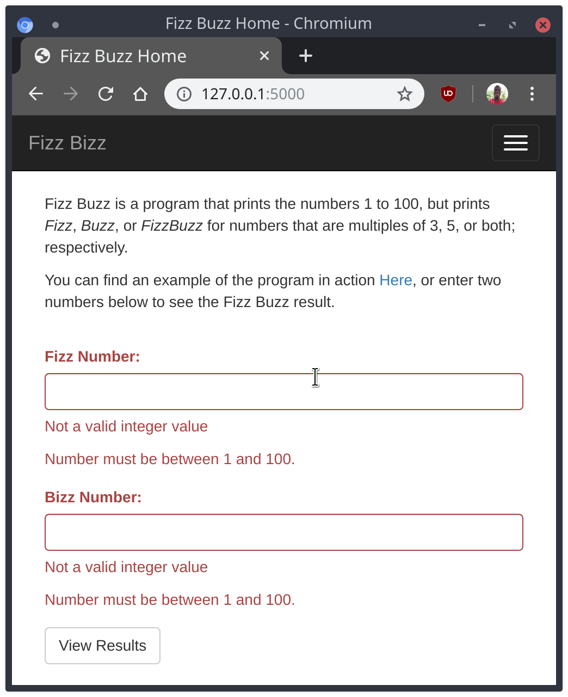
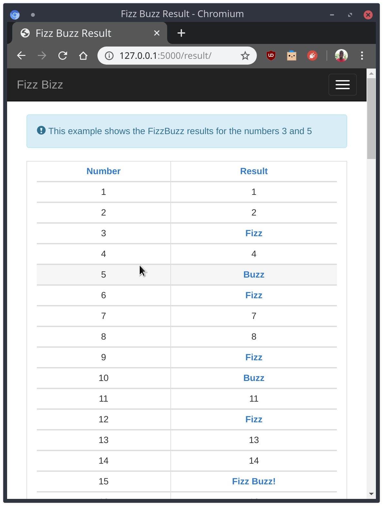

# Fizz Buzz

### Introduction
Fis Buzz is a simple web app developed using Python's microframework Flask. The app takes in two integers as input, ```a``` and ```b```, lists the numbers between 1 and 100, and determines if any of the numbers are a multiple of the integers ```a``` and/or ```b```. In which case it prints:
- ```Fizz``` if the number is a multiple of ```a```
- ```Buzz``` if the number is a multiple of ```b```
- ```Fizz Buzz``` if the number is a multiple of both ```a``` and ```b```

### Form


### Form Validation


### Results

